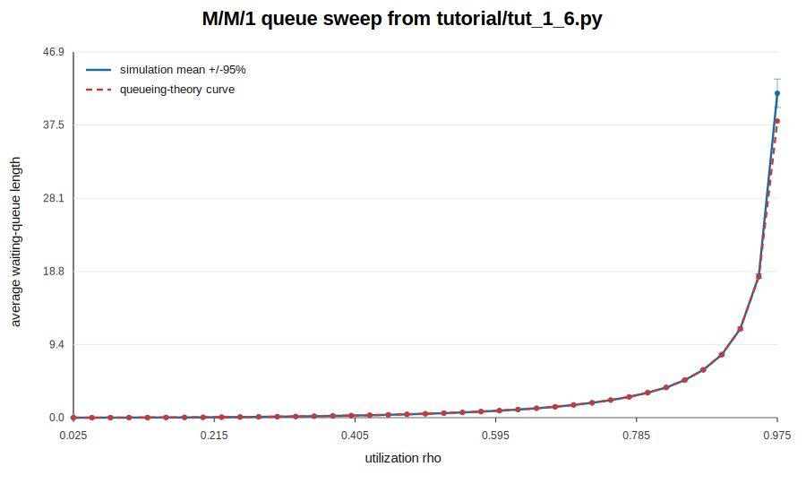
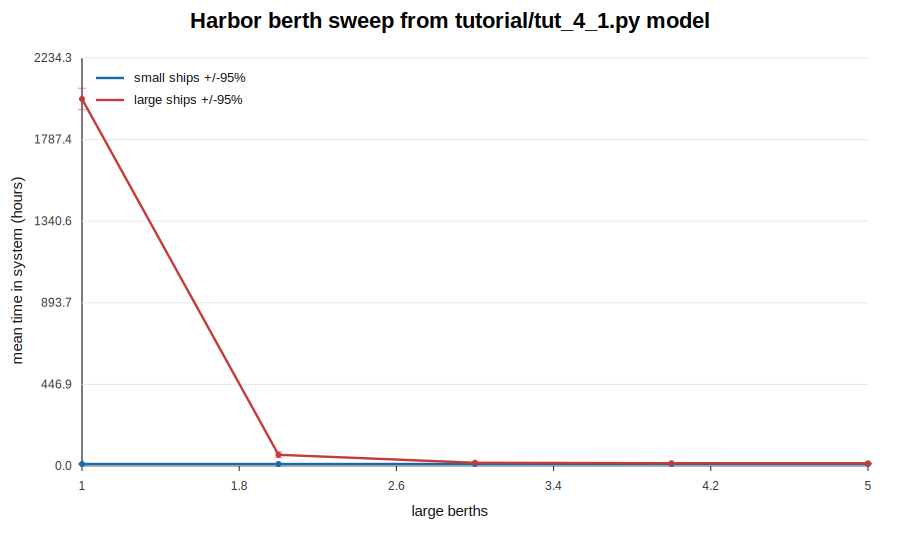

.. _tutorial:

Tutorial: Modeling with Cimba Python
====================================

.. _tut_1:

A simple M/M/1 queue parallelized
---------------------------------

In this section, we will walk through the development of a simple model from
connecting basic entities and interactions to parallelizing the model on all
available CPU cores and producing presentation-ready output.

Our first simulated system is an M/M/1 queue. In queueing theory notation, this
abbreviation indicates a queueing system where the arrival process is memoryless
with exponentially distributed intervals, the service process is the same, there
is only one server, and the queue has unlimited capacity. This is a
mathematically well understood system, which is exactly what we want for a first
simulation model.

The simulation model will verify if the well-known formula for expected queue
length is correct. Or, if one is feeling a bit more modest, it will verify that
our model is close enough to the formula that we have probably connected the
pieces correctly.

Arrival, service, and the queue
^^^^^^^^^^^^^^^^^^^^^^^^^^^^^^^

We model this in a straightforward manner. We need an arrival process that puts
customers into the queue at random intervals, a service process that gets
customers from the queue and services them for a random duration, and the queue
itself. We are not concerned with the characteristics of each customer, just how
many there are in the queue, so we do not need a separate object for each
customer. We will use a ``sim.Queue`` for this.

In Cimba Python, the simulated world's parameters, outputs, and passive
simulation entities are declared as fields on a ``sim.Model`` subclass:

.. code-block:: python

    import cimba
    import cimba.sim as sim

    class MM1(sim.Model):
        utilization: sim.Param
        avg_queue_length: sim.Output
        queue: sim.Queue

    model = MM1("MM1")

``utilization`` is a parameter supplied by the experiment. ``avg_queue_length``
is an output collected at the end of each trial. ``queue`` is a trial-local
simulation queue. Each trial gets its own parameter values, output values, and
queue, so trials can run independently.

Let us start with the arrival and service processes. The code can be very
simple:

.. code-block:: python

    @model.process
    def arrival(env: MM1):
        while True:
            t_ia = sim.exponential(1.0 / env.utilization)
            sim.hold(t_ia)
            sim.put(env.queue, 1)

    @model.process
    def service(env: MM1):
        while True:
            sim.get(env.queue, 1)
            t_srv = sim.exponential(1.0)
            sim.hold(t_srv)

This should hopefully be quite intuitive. The arrival process generates an
exponentially distributed random value with mean ``1 / utilization``, holds for
that amount of interarrival time, puts one new customer into the queue, and does
it again.

Similarly, the service process gets a customer from the queue, waiting for one
to arrive if there are none waiting, generates a random service time with mean
1.0, holds for the service time, and does it all over again. An average arrival
rate of 0.75 and service rate of 1.0 gives the 0.75 utilization we wanted for
the first run.

The ``env`` argument is the trial-local model record. It holds the parameter,
output, state, and entity handles declared on ``MM1``. Process functions are
plain Python functions, but the blocking ``sim`` calls make them simulation
processes. If the service process tries to get from an empty queue, it pauses.
The dispatcher then runs some other event, such as the arrival process waking up
and putting a customer into the queue. When the service process resumes, it
continues immediately after the same ``sim.get()`` call.

Finally, collect a time-weighted queue statistic:

.. code-block:: python

    @model.collect
    def collect_stats(env: MM1):
        env.avg_queue_length = sim.mean_level(env.queue)

The collector runs after the trial finishes. ``sim.mean_level()`` uses the
recording window controlled by the experiment's ``warmup`` and ``duration``.

We also need an experiment to set it all up and run the simulation. Unlike a
lower-level program, there is no manual object lifecycle code here: the model
declaration tells Cimba Python what each trial needs, and
``model.experiment(...)`` generates the trial table.

Let us try this:

.. code-block:: python

    def main() -> None:
        cimba.logger_flags_on(cimba.LOGGER_INFO)
        exp = model.experiment(
            utilization=[0.75],
            replications=1,
            duration=10.0,
            warmup=0.0,
            seed=42,
        )
        failures = exp.run()
        if failures:
            raise RuntimeError(f"{failures} trial(s) failed")
        avg = float(exp["avg_queue_length"][0])
        print(f"Average queue length over the first 10 time units: {avg:.6f}")

There is one utilization value and one replication, so this experiment has one
trial. The seed makes the random stream reproducible. ``exp.run()`` executes the
trial table and returns the number of failed trials. Outputs are available by
name, so ``exp["avg_queue_length"]`` returns an array with one element per
trial.

We can now run ``tutorial/tut_1_1.py`` and see what happens. In the default
release-style build used for this documentation pass, detailed internal trace
logging is compiled out, so this first script prints only the collected result:

.. code-block:: none

    $ .venv/bin/python tutorial/tut_1_1.py
    Average queue length over the first 10 time units: 0.939453

That is not a very informative run yet, but it proves that the model starts,
stops, and produces an output value. We will add more useful logging and
reporting shortly.

Stopping a simulation
^^^^^^^^^^^^^^^^^^^^^

We will address stopping first. An arrival loop and a service loop are both
infinite. That is natural for many simulation processes: a server keeps serving,
a weather process keeps updating, and an arrival process keeps generating work.
A trial therefore needs a separate end condition.

The normal Python way is to pass ``duration`` to ``model.experiment(...)``. The
generated trial starts the registered processes, opens the measurement window
after ``warmup``, closes it at ``warmup + duration``, runs the collectors, and
stops the remaining model processes. For a first model, this is both the
simplest and the least surprising way to stop:

For most models, this is the cleanest stopping rule:

.. code-block:: python

    exp = model.experiment(
        utilization=[0.75],
        replications=1,
        duration=10.0,
        warmup=0.0,
        seed=43,
    )
    exp.run()

Sometimes the domain has its own stop condition: serve 100 customers, empty all
work after closing time, finish a campaign, or stop when a rare event happens.
Use an event callback for that:

.. code-block:: python

    class StopAtCount(sim.Model):
        served: sim.State
        queue: sim.Queue
        arrival: sim.Processes
        service: sim.Processes
        stop_now: sim.Event

    model = StopAtCount("stop-at-count")

    @model.event
    def stop_now(env: StopAtCount):
        sim.stop(env.arrival[0], 0)
        sim.stop(env.service[0], 0)
        sim.clear_events()

    @model.process
    def monitor(env: StopAtCount):
        while env.served < 100:
            sim.hold(1.0)
        sim.schedule(env.stop_now, env, 0.0)

``sim.Processes`` fields publish handles for registered processes. Since
``arrival`` and ``service`` each have one copy, ``env.arrival[0]`` and
``env.service[0]`` identify the running processes. ``sim.schedule()`` schedules
the callback relative to the current simulation time; ``sim.schedule_at()``
schedules at an absolute time. Event handles can be cancelled, rescheduled,
reprioritized, inspected, and waited on with ``sim.wait_event()``.

We run the revised program and it reaches the same 10.0 end time:

.. code-block:: none

    $ .venv/bin/python tutorial/tut_1_2.py
    Simulation stopped at t=10.0, average queue length: 0.000000

Progress: It started, ran, and now also stopped.

Use explicit stopping sparingly. The built-in ``duration`` rule also manages the
statistics window, so it is usually better for performance experiments and
steady-state simulations.

Setting logging levels
^^^^^^^^^^^^^^^^^^^^^^

Next, the verbiage. Cimba Python has logging controls that make it possible to
see what is happening inside a model while it is still small enough that the
trace can be read by a human.

There are two layers of logging control:

* top-level logger flags, toggled with ``cimba.logger_flags_on()`` and
  ``cimba.logger_flags_off()``,
* and process-body helpers in ``cimba.sim``.

The process-body helpers are intentionally simple: they log static text,
integer values, or floating-point values. Register the text once, outside the
process body:

.. code-block:: python

    import cimba
    import cimba.sim as sim

    USERFLAG1 = 0x00000001

    MSG_ARR_HOLD = sim.log_text("Holds for")
    MSG_ARR_PUT = sim.log_text("Puts one into the queue")
    MSG_SRV_GET = sim.log_text("Gets one from the queue")
    MSG_SRV_HOLD = sim.log_text("Got one, services it for")

    @model.process
    def arrival(env: MM1):
        while True:
            t_ia = sim.exponential(1.0 / env.utilization)
            sim.log_user_f64(USERFLAG1, MSG_ARR_HOLD, t_ia)
            sim.hold(t_ia)
            sim.log_user(USERFLAG1, MSG_ARR_PUT)
            sim.put(env.queue, 1)

    @model.process
    def service(env: MM1):
        while True:
            sim.log_user(USERFLAG1, MSG_SRV_GET)
            sim.get(env.queue, 1)
            t_srv = sim.exponential(1.0)
            sim.log_user_f64(USERFLAG1, MSG_SRV_HOLD, t_srv)
            sim.hold(t_srv)

And choose the flags for the run:

.. code-block:: python

    cimba.logger_flags_off(cimba.LOGGER_INFO)
    cimba.logger_flags_on(USERFLAG1)

We run ``tutorial/tut_1_3.py`` and get this output:

.. code-block:: none

    $ .venv/bin/python tutorial/tut_1_3.py
    0        0.0000    arrival     python (0):  Holds for 0.144672
    0        0.0000    service     python (0):  Gets one from the queue
    0       0.14467    arrival     python (0):  Puts one into the queue
    0       0.14467    arrival     python (0):  Holds for 0.353541
    0       0.14467    service     python (0):  Got one, services it for 0.285614
    0       0.43029    service     python (0):  Gets one from the queue
    0       0.49821    arrival     python (0):  Puts one into the queue
    0       0.49821    arrival     python (0):  Holds for 1.050368
    0       0.49821    service     python (0):  Got one, services it for 1.942461
    0        1.5486    arrival     python (0):  Puts one into the queue
    0        1.5486    arrival     python (0):  Holds for 1.773069
    0        2.4407    service     python (0):  Gets one from the queue
    0        2.4407    service     python (0):  Got one, services it for 0.209677
    0        2.6504    service     python (0):  Gets one from the queue
    0        3.3217    arrival     python (0):  Puts one into the queue
    0        3.3217    arrival     python (0):  Holds for 0.349020
    0        3.3217    service     python (0):  Got one, services it for 0.067436
    0        3.3891    service     python (0):  Gets one from the queue
    0        3.6707    arrival     python (0):  Puts one into the queue
    0        3.6707    arrival     python (0):  Holds for 0.307979
    0        3.6707    service     python (0):  Got one, services it for 0.185038
    0        3.8557    service     python (0):  Gets one from the queue
    0        3.9787    arrival     python (0):  Puts one into the queue
    0        3.9787    arrival     python (0):  Holds for 0.960811
    0        3.9787    service     python (0):  Got one, services it for 0.618192
    0        4.5968    service     python (0):  Gets one from the queue
    0        4.9395    arrival     python (0):  Puts one into the queue
    0        4.9395    arrival     python (0):  Holds for 2.020638
    0        4.9395    service     python (0):  Got one, services it for 0.006503
    0        4.9460    service     python (0):  Gets one from the queue
    0        6.9601    arrival     python (0):  Puts one into the queue
    0        6.9601    arrival     python (0):  Holds for 1.498207
    0        6.9601    service     python (0):  Got one, services it for 0.056081
    0        7.0162    service     python (0):  Gets one from the queue
    0        8.4583    arrival     python (0):  Puts one into the queue
    0        8.4583    arrival     python (0):  Holds for 0.707779
    0        8.4583    service     python (0):  Got one, services it for 0.452901
    0        8.9112    service     python (0):  Gets one from the queue
    0        9.1661    arrival     python (0):  Puts one into the queue
    0        9.1661    arrival     python (0):  Holds for 0.614626
    0        9.1661    service     python (0):  Got one, services it for 0.182892
    0        9.3490    service     python (0):  Gets one from the queue
    0        9.7807    arrival     python (0):  Puts one into the queue
    0        9.7807    arrival     python (0):  Holds for 0.825184
    0        9.7807    service     python (0):  Got one, services it for 2.091059
    Average queue length with user logging enabled: 0.089209

Only our user-defined logging messages are printed. The simulation time, active
process, and trial index are still prepended, which is exactly what we want when
debugging process interactions.

Because trials may run in parallel, log lines from different trials can
interleave. Logging is therefore best for short debugging runs, not for
production sweeps.

Collecting and reporting statistics
^^^^^^^^^^^^^^^^^^^^^^^^^^^^^^^^^^^

Which brings us to getting some useful output. By now, we are suitably convinced
that our simulated M/M/1 queue is behaving as expected, so we want it to report
statistics on the queue length.

The M/M/1 formula predicts an expected waiting-queue length

.. math::

    L_q = \frac{\rho^2}{1-\rho}

where ``rho`` is utilization. With ``rho = 0.75``, the expected waiting-queue
length is 2.25. Short runs vary wildly, so we increase the running time from ten
to one million time units and skip the first thousand time units as warmup:

.. code-block:: python

    exp = model.experiment(
        utilization=[0.75],
        replications=1,
        duration=1.0e6,
        warmup=1.0e3,
        seed=45,
    )
    failures = exp.run()
    if failures:
        raise RuntimeError(f"{failures} trial(s) failed")
    print(float(exp["avg_queue_length"][0]))

Time-weighted entity summaries are the right tool for levels and utilization:
``sim.mean_level()`` for queues, ``sim.mean_in_use()`` for resources,
``sim.pool_mean_in_use()`` for pools, ``sim.store_mean_length()`` for stores,
and ``sim.pq_mean_length()`` for priority queues. These convenience functions
are shorthand for getting the entity's recorded time series and summarizing it.
For example, the following two assignments are equivalent:

.. code-block:: python

    @model.collect
    def collect_stats(env: MM1):
        env.avg_queue_length = sim.mean_level(env.queue)

        queue_ts = sim.queue_history(env.queue)
        env.avg_queue_length = sim.timeseries_mean(queue_ts)

The explicit history form also gives access to text reports and diagnostic
plots. During a single-trial debugging run, print the queue report and a partial
autocorrelation correlogram directly from the collector:

.. code-block:: python

    @model.collect
    def collect_stats(env: MM1):
        history = sim.queue_history(env.queue)
        env.avg_queue_length = sim.timeseries_mean(history)
        sim.queue_report(env.queue)
        sim.timeseries_pacf_correlogram(history, lags=20)

Very shortly thereafter, output appears. This block is from an actual run of
``.venv/bin/python tutorial/tut_1_4.py``:

.. code-block:: none

    Buffer levels for queue
    N  1312937  Mean    2.256  StdDev    2.850  Variance    8.123  Skewness    2.594  Kurtosis    10.26
    --------------------------------------------------------------------------------
    ( -Infinity,      0.000)   |
    [     0.000,      1.900)   |##################################################
    [     1.900,      3.800)   |###############=
    [     3.800,      5.700)   |#########-
    [     5.700,      7.600)   |#####-
    [     7.600,      9.500)   |##=
    [     9.500,      11.40)   |#=
    [     11.40,      13.30)   |=
    [     13.30,      15.20)   |=
    [     15.20,      17.10)   |-
    [     17.10,      19.00)   |-
    [     19.00,      20.90)   |-
    [     20.90,      22.80)   |-
    [     22.80,      24.70)   |-
    [     24.70,      26.60)   |-
    [     26.60,      28.50)   |-
    [     28.50,      30.40)   |-
    [     30.40,      32.30)   |-
    [     32.30,      34.20)   |-
    [     34.20,      36.10)   |-
    [     36.10,      38.00)   |-
    [     38.00,  Infinity )   |-
    --------------------------------------------------------------------------------
               -1.0                              0.0                              1.0
    --------------------------------------------------------------------------------
       1   0.954                                  |###############################-
       2   0.342                                  |###########-
       3  -0.173                            =#####|
       4   0.137                                  |####=
       5  -0.089                               =##|
       6   0.087                                  |##=
       7  -0.057                                =#|
       8   0.064                                  |##-
       9  -0.046                                =#|
      10   0.051                                  |#=
      11  -0.037                                -#|
      12   0.043                                  |#-
      13  -0.031                                -#|
      14   0.034                                  |#-
      15  -0.027                                 =|
      16   0.032                                  |#-
      17  -0.025                                 =|
      18   0.029                                  |=
      19  -0.022                                 =|
      20   0.025                                  |=
    --------------------------------------------------------------------------------
    Theory predicts an average M/M/1 waiting-queue length of 2.25
    Simulation result: 2.256006

The text-mode histogram uses ``#`` for a full bar segment, ``=`` for a segment
more than half full, and ``-`` for a segment that contains something but less
than half a full segment. This is not publication-ready graphics, but it is
surprisingly useful at the model development stage. We have numbers. Theory
predicts 2.25. The run above gave 2.256006.

Close, but is it close enough? We need more resolving power.

The ``*_file()`` variants write the same text output to a path handle created
with ``sim.log_text()``:

.. code-block:: python

    REPORT = sim.log_text("mm1_queue_report.txt")

    @model.collect
    def collect_stats(env: MM1):
        sim.queue_report_file(env.queue, REPORT, append=0)

Use stdout reports for short single-trial runs. In parallel experiments, text
from several trials may interleave; prefer scalar outputs for final analysis
and file reports only when each run has an unambiguous destination.

Use ``sim.Dataset`` when you need to record individual samples, such as each
customer's time in system:

.. code-block:: python

    class Waits(sim.Model):
        wait_mean: sim.Output
        wait_std: sim.Output
        waits: sim.Dataset

    @model.process
    def observer(env: Waits):
        sim.tally(env.waits, 2.5)
        sim.tally(env.waits, 3.0)
        sim.suspend()

    @model.collect
    def collect(env: Waits):
        env.wait_mean = sim.dataset_mean(env.waits)
        env.wait_std = sim.dataset_std(env.waits)

Datasets also provide count, minimum, and maximum. They are useful for
per-agent outcomes; time-weighted summaries are useful for states that persist
between event times. Datasets also have the same text-reporting style:

.. code-block:: python

    @model.collect
    def collect(env: Waits):
        env.wait_mean = sim.dataset_mean(env.waits)
        env.wait_std = sim.dataset_std(env.waits)

        sim.dataset_fivenum(env.waits)
        sim.dataset_histogram(env.waits, bins=20)
        sim.dataset_correlogram(env.waits, lags=20)
        sim.dataset_pacf_correlogram(env.waits, lags=20)

Use ``sim.dataset_print()`` when you want the raw sample values themselves.
Use ``sim.dataset_print_file()``, ``sim.dataset_fivenum_file()``,
``sim.dataset_histogram_file()``, ``sim.dataset_correlogram_file()``, and
``sim.dataset_pacf_correlogram_file()`` to write those reports to files.

Refactoring for parallelism
^^^^^^^^^^^^^^^^^^^^^^^^^^^

Before parallelizing, we will clean up a few rough edges. The first examples put
everything at module scope. That is fine for a toy, but larger projects benefit
from a builder function and from grouping repeated model structure into
components. For the M/M/1 model, the queue and its two process loops form a
natural station:

.. code-block:: python

    class MM1Station(sim.Component):
        queue: sim.Queue

        @sim.process
        def arrival(self, env):
            while True:
                t_ia = sim.exponential(1.0 / env.utilization)
                sim.hold(t_ia)
                sim.put(self.queue, 1)

        @sim.process
        def service(self, env):
            while True:
                sim.get(self.queue, 1)
                t_srv = sim.exponential(1.0)
                sim.hold(t_srv)

    class MM1(sim.Model):
        utilization: sim.Param
        avg_queue_length: sim.Output
        station: MM1Station = MM1Station()

Component process methods are lowered into ordinary model processes before
compilation. Inside the component, ``self.queue`` refers to the queue declared
on the station instance. The compiled trial record remains flat, but the source
code can stay grouped around the station concept.

The builder now only needs to create the model and register the collector:

.. code-block:: python

    def build_model() -> MM1:
        model = MM1("MM1")

        @model.collect
        def collect_stats(env: MM1):
            env.avg_queue_length = sim.mean_level(env.station.queue)

        return model

This pattern makes it easy to write tests, command-line scripts, notebooks, and
benchmarks that all build the same model. It also separates model declaration
from experiment setup. Parameters and outputs belong to the trial table;
component process logic belongs with the component, and experiment setup belongs
outside the model.

Model callbacks can read component fields with natural dotted access such as
``env.station.queue``. Cimba lowers that access to the flat internal field
before compilation. In the experiment table, component fields still use
flattened names for now, such as ``station__queue``.

Repeated structures can be grouped the same way with standard Python list
annotations:

.. code-block:: python

    class Attraction(sim.Component):
        queues: sim.PQueues = sim.count("queue_count")

        def __init__(self, queue_count: int, server_count: int):
            self.queue_count = queue_count
            self.server_count = server_count

        @sim.process(copies="server_count")
        def server(self, env, idx):
            q = self.queues[idx % self.queue_count]
            # serve one visitor from q ...

    class Park(sim.Model):
        attractions: list[Attraction] = [
            Attraction(queue_count=1, server_count=1),
            Attraction(queue_count=3, server_count=3),
        ]

Model callbacks can index the collection with
``env.attractions[i].queues[j]``. Cimba lowers that to flattened fields and
generated offset arrays; experiment fields still use names such as
``attractions__queues`` and ``attractions__server_state``.

Components can also contain other components. This is useful when a natural
object has smaller named parts:

.. code-block:: python

    class RideQueues(sim.Component):
        line: sim.PQueues = sim.count("queue_count")

        def __init__(self, queue_count: int):
            self.queue_count = queue_count

    class RideServers(sim.Component):
        served: sim.State

    class Attraction(sim.Component):
        queues: RideQueues
        servers: RideServers

        def __init__(self, queue_count: int, server_count: int):
            self.queues = RideQueues(queue_count)
            self.servers = RideServers()
            self.server_count = server_count

        @sim.process(copies="server_count")
        def server(self, env, idx):
            q = self.queues.line[idx % self.queues.queue_count]
            self.servers.served += 1
            # serve one visitor from q ...

Nested fields use the same flattened public naming convention:
``env.attractions[i].queues.line[j]`` is stored under
``attractions__queues__line``.

.. code-block:: python

    def run_mm1_trial(
        *,
        rho: float,
        duration: float,
        warmup: float,
        seed: int,
    ) -> float:
        exp = build_model().experiment(
            utilization=[rho],
            replications=1,
            duration=duration,
            warmup=warmup,
            seed=seed,
        )
        failures = exp.run()
        if failures:
            raise RuntimeError(f"{failures} trial(s) failed")
        return float(exp["avg_queue_length"][0])

Parallelization
^^^^^^^^^^^^^^^

So far, we have been developing the model as if it were a single run. The
simulation is already fast, but a modern CPU has many cores, most of them idly
watching our work so far with detached interest. Let's put them to work.

Parallelizing a single simulated world is hard because the outcome of one event
may influence all future events. Parallelizing an experiment is much easier. We
rarely want only one run. We want many replications, many parameter
combinations, or both. These trials are designed to be independent, so they can
run at the same time.

In Cimba Python, parallel experiments are just larger trial tables. Parameter
values are arrays, and ``replications`` repeats every parameter combination:

.. code-block:: python

    import numpy as np

    rhos = np.arange(0.025, 1.0, 0.025)
    replications = 10

    exp = build_model().experiment(
        utilization=rhos,
        replications=replications,
        duration=1.0e6,
        warmup=1.0e3,
        seed=42,
    )
    failures = exp.run()
    if failures:
        raise RuntimeError(f"{failures} trial(s) failed")

    values = exp["avg_queue_length"].reshape(len(rhos), replications)

When the run is finished, summarize each row:

.. code-block:: python

    print(f"{'rho':>8} {'simulated':>10} {'+/-95%':>10} {'theory':>10}")
    for rho, samples in zip(rhos, values):
        mean = float(samples.mean())
        ci = float(1.96 * samples.std(ddof=1) / np.sqrt(samples.size))
        theory = rho * rho / (1.0 - rho)
        print(f"{rho:8.3f} {mean:10.4f} {ci:10.4f} {theory:10.4f}")

``tutorial/tut_1_7.py`` is the command-line version. It accepts replication
count, duration, warmup, seed, and an optional timing flag. The shorter
``tutorial/tut_1_6.py`` script prints this table:

.. code-block:: none

    $ .venv/bin/python tutorial/tut_1_6.py
    cimba 3.0.0-beta
         rho  simulated     +/-95%     theory
       0.025     0.0006     0.0000     0.0006
       0.050     0.0026     0.0001     0.0026
       0.075     0.0061     0.0001     0.0061
       0.100     0.0111     0.0001     0.0111
       0.125     0.0177     0.0002     0.0179
       0.150     0.0266     0.0002     0.0265
       0.175     0.0371     0.0002     0.0371
       0.200     0.0500     0.0004     0.0500
       0.225     0.0651     0.0003     0.0653
       0.250     0.0832     0.0004     0.0833
       0.275     0.1046     0.0007     0.1043
       0.300     0.1284     0.0007     0.1286
       0.325     0.1559     0.0011     0.1565
       0.350     0.1892     0.0008     0.1885
       0.375     0.2257     0.0007     0.2250
       0.400     0.2680     0.0014     0.2667
       0.425     0.3143     0.0013     0.3141
       0.450     0.3674     0.0013     0.3682
       0.475     0.4294     0.0016     0.4298
       0.500     0.4989     0.0020     0.5000
       0.525     0.5800     0.0027     0.5803
       0.550     0.6712     0.0031     0.6722
       0.575     0.7789     0.0035     0.7779
       0.600     0.9024     0.0047     0.9000
       0.625     1.0417     0.0068     1.0417
       0.650     1.2059     0.0059     1.2071
       0.675     1.3928     0.0068     1.4019
       0.700     1.6293     0.0071     1.6333
       0.725     1.9034     0.0115     1.9114
       0.750     2.2564     0.0156     2.2500
       0.775     2.6621     0.0205     2.6694
       0.800     3.2082     0.0303     3.2000
       0.825     3.8639     0.0318     3.8893
       0.850     4.8088     0.0638     4.8167
       0.875     6.1282     0.0778     6.1250
       0.900     8.0668     0.1274     8.1000
       0.925    11.3918     0.2103    11.4083
       0.950    18.1704     0.2903    18.0500
       0.975    41.5860     1.8192    38.0250

Evidently, we cannot reject the hypothesis that conventional queueing theory
may be correct. Nor can we reject the hypothesis that Cimba Python may be
working correctly.

The plot below was generated from that same run, using
``tutorial/tut_1_6.py`` data and a small SVG writer:

This concludes the first tutorial. We have followed the development steps from
a first minimal model demonstrating process interactions to a complete
parallelized experiment with summarized output. The files
``tutorial/tut_1_*.py`` include working code for each stage of development.

.. _tut_2:

Acquiring, preempting, holding, and releasing resources, with interruptions
---------------------------------------------------------------------------

We will now introduce ways of acquiring and releasing resources of various
kinds. We will also show additional process interactions where one active
process acts directly on another process. We will demonstrate these through a
somewhat cartoonish example, but first we need a little background.

Resources and resource pools
^^^^^^^^^^^^^^^^^^^^^^^^^^^^

Cimba Python provides two kinds of resources that a process can acquire, hold,
and release. ``sim.Resource`` is a single exclusive unit, while ``sim.Pool`` is
a collection of interchangeable units. In computer science terms, the first is
a binary semaphore and the second is a counting semaphore.

If the requested resource or number of pool units is not available, the acquire
call waits in priority order. The ordering is determined first by process
priority, then by arrival order among processes with the same priority. Changing
a process priority with ``sim.set_priority()`` also affects its place in
waiting queues.

The typical usage pattern is also the reason the time-delay function is called
``sim.hold()``:

.. code-block:: python

    class Shop(sim.Model):
        station: sim.Resource
        tools: sim.Pool = 8

    model = Shop("shop")

    @model.process
    def job(env: Shop):
        station_sig = sim.acquire(env.station)
        if station_sig != sim.SUCCESS:
            return

        tool_sig = sim.pool_acquire(env.tools, 3)
        if tool_sig == sim.SUCCESS:
            sim.hold(5.0)
            sim.pool_release(env.tools, 3)

        sim.release(env.station)

Or, for a pool:

.. code-block:: python

    @model.process
    def job(env: Shop):
        sig = sim.pool_acquire(env.tools, 6)
        if sig == sim.SUCCESS:
            sim.hold(2.0)
            sim.pool_release(env.tools, 3)
            sim.hold(1.0)
            sim.pool_release(env.tools, 3)

Note that resources and pools are different from count queues. It is meaningful
to put 100 items into a queue with capacity 10; the process can fill the queue,
wait for space, and continue until all 100 are in. It is not meaningful to
acquire 11 units from a pool whose maximum capacity is 10. That model request
cannot ever be satisfied, so it should be treated as a model error.

The return value matters. A process may wake because the request succeeded, but
it may also wake because it was interrupted, stopped, timed out, cancelled, or
preempted. The common signal constants are ``sim.SUCCESS``,
``sim.PREEMPTED``, ``sim.INTERRUPTED``, ``sim.STOPPED``, ``sim.CANCELLED``,
and ``sim.TIMEOUT``.

Pool accounting should be read from the pool when correctness matters:

.. code-block:: python

    me = sim.current()
    held = sim.pool_held(env.tools, me)
    available = sim.pool_available(env.tools)
    in_use = sim.pool_in_use(env.tools)

This is especially important when preemption is possible. A process can lose
capacity while blocked in a different call, so a local variable that says "I
think I hold 4 units" should be resynchronized with ``sim.pool_held()`` after
any blocking operation.

Preemptions and interruptions
^^^^^^^^^^^^^^^^^^^^^^^^^^^^^

A yielded process does not have any guarantees about what may happen before it
resumes control. Other processes may act on it, perhaps stopping it outright,
waking it up early, or taking away resources it is holding. To tell these cases
apart, blocking process and resource calls return integer signals.

Preemption is a resource-pool operation: a higher-priority process can take
capacity away from lower-priority holders. Interruption is process-directed: a
process handle is woken with a signal.

.. code-block:: python

    class Crew(sim.Model):
        worker: sim.Processes = 4
        tools: sim.Pool = 10
        interrupted: sim.State
        preempted: sim.State

    model = Crew("crew")

    @model.process(copies=4)
    def worker(env: Crew, idx: int):
        me = sim.current()
        held = 0
        while True:
            sim.set_priority(me, idx)
            sig = sim.pool_acquire(env.tools, 4)
            held = sim.pool_held(env.tools, me)
            if sig == sim.PREEMPTED:
                env.preempted += 1
            elif sig != sim.SUCCESS:
                env.interrupted += 1

            sig = sim.hold(100.0)
            held = sim.pool_held(env.tools, me)
            if sig == sim.PREEMPTED:
                env.preempted += 1
            elif sig != sim.SUCCESS:
                env.interrupted += 1

            if held:
                sim.pool_release(env.tools, held)

    @model.process
    def supervisor(env: Crew):
        sim.hold(1.0)
        sim.interrupt(env.worker[0], sim.INTERRUPTED, 0)
        sim.pool_preempt(env.tools, 6)

The supervisor uses the process handles published by ``env.worker``. In a real
model this could be an emergency dispatcher interrupting a crew, a maintenance
controller stopping a machine, or a triage process changing a patient's path.

There are several possible outcomes when a process is waiting for more capacity:

1. The request succeeds and the call returns ``sim.SUCCESS``.
2. A higher-priority process preempts capacity and the waiting process wakes with
   ``sim.PREEMPTED``.
3. Another process interrupts it with ``sim.interrupt()``, and the call returns
   the signal value chosen by the interrupter.

This is why the example checks both the return signal and the amount still held.
Signals explain why the process woke. Entity queries such as ``sim.pool_held()``
tell the process what the simulated world looks like now.

Buffers and object queues, interrupted
^^^^^^^^^^^^^^^^^^^^^^^^^^^^^^^^^^^^^^

The semantics of queues and stores are different from resources. A process can
hold a resource, making it unavailable until released. Queue contents are not
held in the same sense: once an item is put in, another process may get it and
consume it immediately.

``sim.Queue`` stores counts. ``sim.Store`` stores integer payloads.
``sim.PQueues`` stores integer payloads ordered by priority. All of them can
block, so the same signal discipline applies.

.. code-block:: python

    class Inbox(sim.Model):
        jobs: sim.Store = 10
        completed: sim.State

    model = Inbox("inbox")

    @model.process
    def producer(env: Inbox):
        for job_id in range(100):
            sig = sim.store_put(env.jobs, job_id)
            if sig != sim.SUCCESS:
                return

    @model.process
    def consumer(env: Inbox):
        while True:
            job_id = sim.store_get(env.jobs)
            sim.hold(1.0 + job_id % 3)
            env.completed += 1

Use ``sim.store_take()`` when a process needs a specific payload, not simply
the next available one. Priority queues add ``sim.pq_put()``, ``sim.pq_get()``,
``sim.pq_take()``, ``sim.pq_position()``, ``sim.pq_reprioritize()``, and
``sim.pq_cancel()``.

While the cat is away...
^^^^^^^^^^^^^^^^^^^^^^^^

It is again probably easier to demonstrate with code than explain in abstract
terms how all this works.

Imagine a pile of reusable capacity. Several polite agents repeatedly acquire
some amount, hold it for a while, and release part or all of it. A few more
aggressive agents use preemption instead. A controller sleeps most of the time,
but occasionally wakes and interrupts a random active process. The interactions
can get intricate, which is exactly why this makes a good stress test.

In Python, represent the agents as process copies and use process arrays for
targeting:

.. code-block:: python

    class Game(sim.Model):
        polite: sim.Processes = 5
        aggressive: sim.Processes = 2
        resource: sim.Pool = 20
        controller_actions: sim.State

    model = Game("game")

    @model.process(copies=5)
    def polite(env: Game):
        me = sim.current()
        while True:
            amount = sim.dice(1, 5)
            sim.set_priority(me, sim.dice(-10, 10))
            sig = sim.pool_acquire(env.resource, amount)
            if sig == sim.SUCCESS:
                sim.hold(sim.exponential(1.0))
                held = sim.pool_held(env.resource, me)
                if held:
                    sim.pool_release(env.resource, sim.dice(1, held))

    @model.process(copies=2)
    def aggressive(env: Game):
        me = sim.current()
        while True:
            amount = sim.dice(3, 10)
            sim.set_priority(me, sim.dice(-5, 15))
            sim.pool_preempt(env.resource, amount)
            sim.hold(sim.exponential(1.0))

    @model.process
    def controller(env: Game):
        while True:
            sim.hold(sim.exponential(5.0))
            if sim.flip() == 1:
                target = env.polite[sim.dice(0, 4)]
            else:
                target = env.aggressive[sim.dice(0, 1)]
            sim.interrupt(target, sim.INTERRUPTED, 0)
            env.controller_actions += 1

The lesson is not the particular story. The lesson is that handles let one
process act on another, and signals let the target process learn why it woke.

The runnable version in ``tutorial/tut_2_1.py`` tallies the outcomes instead of
printing every step. A typical run reports averages like this:

.. code-block:: none

    $ .venv/bin/python tutorial/tut_2_1.py
    cimba 3.0.0-beta, using 16 worker threads
    5 mice and 2 rats compete for 20 cheese cubes, 1 cat chases the rodents
    10 trials of 100000 time units in 0.15 s, 0 failed

                  grabbed     stolen  preempted interrupted
          mice     366108     166020      67314       14501
          rats     358075     107176      16537        5566

    cat chases: 28544 per trial
    cheese in use: 18.9 of 20 cubes on average
    accounting errors (held vs pool_held): 0

The exact names in the example are deliberately less important than the
accounting result. Even under heavy preemption and interruption, the resource
pool's record of who holds what remains consistent.

Real world uses
^^^^^^^^^^^^^^^

The example above is intentionally frantic. We want to exercise many possible
interleavings of acquire, preempt, hold, release, and interrupt calls. Real
models will usually be calmer, but the same mechanisms are important in a wide
range of applications:

* staff shared across patient classes,
* repair crews preempted by urgent failures,
* transport vehicles interrupted by dispatch decisions,
* machines that lose capacity while jobs are waiting,
* berths, chargers, runways, or rooms allocated by priority.

When the model can be interrupted, write process code as a sequence of
recoverable states. After each blocking call, inspect the signal and ask the
entity what it still holds before deciding the next action.

This completes the second tutorial, demonstrating how to acquire and release
resources, and how to use direct process interactions like ``sim.interrupt()``
and ``sim.pool_preempt()``. We also mentioned, but did not dwell on,
``sim.wait_process()`` and ``sim.wait_event()``. Those are waiting tools for
joining another process or waiting on a scheduled event handle.

.. _tut_3:

Agents balking, reneging, and jockeying in queues
-------------------------------------------------

In :ref:`our first tutorial <tut_1>`, we modeled an M/M/1 queue as a simple
count. That was sufficient to calculate queue length statistics. We now extend
this to a more realistic and analytically intractable case where the customers
are active, opinionated agents in their own right.

The customers generated by the arrival process will make their own decisions on
whether to join a queue or not (balking), leave midway (reneging), or switch to
another queue that seems to be moving faster (jockeying). Or patiently wait
until they get served and then leave for new adventures.

The use case is an amusement park with guests wanting to use various
attractions, where the park operator wants us to analyze ways of influencing
customer behavior. The overall metric is the time spent in the park per visitor
and the breakdown of this time between riding, waiting, and walking. The time
unit is minutes.

Process-local state with sim.Struct
^^^^^^^^^^^^^^^^^^^^^^^^^^^^^^^^^^^

The object-oriented paradigm is very natural for simulation modeling. In Python,
we use a ``sim.Struct`` subclass when each process instance needs its own
fields: entry time, priority, patience, current queue, time spent walking, time
spent waiting, and so on.

.. code-block:: python

    class Visitor(sim.Struct):
        patience: float
        priority: int
        entry_park: float
        entry_queue: float
        riding: float
        waiting: float
        walking: float
        rides: int

    class VisitorFlow(sim.Component):
        visitor: sim.Spawnable
        departed: sim.Store
        d_park: sim.Dataset
        d_rides: sim.Dataset

We will combine this visitor-flow component with the attraction components
shortly.

A ``sim.Component`` is an authoring-time grouping for related declarations and
process methods. It is not a separate runtime object inside the compiled trial
record. Instead, Cimba lowers component fields into ordinary flat fields before
compilation. That means we can write model code in the natural domain shape
(``env.flow.d_park`` or ``env.attractions[i].queues.line[j]``) while the
compiled data layout stays simple and fast.

Components are useful when a concept has both state and behavior. In this
example, ``VisitorFlow`` owns the visitor lifecycle: arrivals, dynamic visitor
processes, departure cleanup, counters, and datasets. The attractions will form
a component collection because the park has several repeated ride stations with
the same structure but different constants.

``sim.Spawnable`` means visitor processes are created dynamically. The arrival
process spawns a new visitor and initializes its fields before the visitor first
runs:

.. code-block:: python

    class VisitorFlow(sim.Component):
        visitor: sim.Spawnable

        @sim.process
        def arrivals(self, env):
            while True:
                sim.hold(sim.exponential(2.0))
                handle = sim.spawn(self.visitor, env, priority=0)
                vip = Visitor(handle)
                vip.entry_park = sim.now()
                vip.patience = sim.triangular(0.5, 1.0, 1.5)
                vip.priority = 5 if sim.bernoulli(0.25) else 0

The visitor process receives its own view as the final annotated parameter on
the component method:

.. code-block:: python

    class VisitorFlow(sim.Component):
        visitor: sim.Spawnable

        @sim.process
        def visitor(self, env, vip: Visitor):
            me = sim.current()
            vip.entry_queue = sim.now()
            q = env.attractions[0].queues.line[0]
            entry = sim.pq_put(q, me, vip.priority)
            sig = sim.suspend()
            if sig == sim.SUCCESS:
                vip.rides += 1

Here, ``self.visitor`` is the component-owned spawnable field, while the ride
queues live on the attraction components. Model callbacks and component
processes can still use natural dotted paths such as
``env.attractions[0].queues.line[0]``; Cimba lowers those paths to the flat
trial record before compilation.

The same pattern is useful for the whole visitor lifecycle. The component owns
arrival generation, visitor behavior, departure cleanup, counters, and datasets:

.. code-block:: python

    class VisitorFlow(sim.Component):
        balks: sim.State
        jockeys: sim.State
        reneges: sim.State

        visitor: sim.Spawnable
        departed: sim.Store
        d_park: sim.Dataset
        d_riding: sim.Dataset
        d_waiting: sim.Dataset
        d_walking: sim.Dataset
        d_rides: sim.Dataset

        @sim.process
        def arrivals(self, env):
            # spawn visitors until closing time
            ...

        @sim.process
        def visitor(self, env, vip: Visitor):
            # walk, queue, balk, renege, jockey, ride, and leave
            ...

        @sim.process
        def departures(self, env):
            while True:
                sim.despawn(sim.store_take(self.departed))

Another process can use ``Visitor(handle)`` to view and update the same fields.
That is how a ride server records waiting and riding time for the visitor it
has just taken from a priority queue. In other words, the visitor is both an
active process and a small object carrying its own attributes and accumulated
statistics.

The ride servers belong naturally to attractions. Each attraction owns its
priority queues and starts one server process copy per physical ride server:

``RideQueues`` is a nested component. It gives the queue group its own name
inside an ``Attraction`` instead of leaving every queue field directly on the
top-level model. ``Attraction`` then uses a component process method for the
server loop. Inside that method, ``self.queues.line[...]`` refers to the queues
of this attraction instance, and ``self.batch_size`` or ``self.dmin`` are
per-attraction primitive constants captured from ``__init__``.

.. code-block:: python

    class RideQueues(sim.Component):
        line: sim.PQueues = sim.count("queue_count")

        def __init__(self, queue_count: int):
            self.queue_count = queue_count

    class Attraction(sim.Component):
        queues: RideQueues

        def __init__(self, attraction: int):
            self.queue_count = int(NUM_QUEUES[attraction])
            self.servers_per_q = int(SERVERS_PER_Q[attraction])
            self.server_count = self.queue_count * self.servers_per_q
            self.batch_size = int(BATCH_SIZES[attraction])
            self.dmin = float(MIN_DUR[attraction])
            self.dmode = float(MODE_DUR[attraction])
            self.dmax = float(MAX_DUR[attraction])
            self.queues = RideQueues(self.queue_count)

        @sim.process(copies="server_count")
        def server(self, env, idx: int):
            q = self.queues.line[idx // self.servers_per_q]
            riders = np.empty(MAX_BATCH, dtype=np.int64)

            while True:
                riders[0] = sim.pq_take(q)
                cnt = 1
                while sim.pq_length(q) > 0 and cnt < self.batch_size:
                    riders[cnt] = sim.pq_take(q)
                    cnt += 1

                boarding = sim.now()
                for i in range(cnt):
                    sim.timers_clear(riders[i])
                    vip = Visitor(riders[i])
                    vip.waiting += boarding - vip.entry_queue

                dur = sim.pert(self.dmin, self.dmode, self.dmax)
                sim.hold(dur)

                for i in range(cnt):
                    Visitor(riders[i]).riding += dur
                    sim.resume(riders[i], sim.SUCCESS)

The top-level model is now mostly composition:

The list annotation below creates a component collection. Cimba instantiates one
lowered process namespace for the collection, so the nine attraction templates
share an indexed process such as ``attractions__server``. Their queue arrays are
stored together, and source code can still index them by attraction.

.. code-block:: python

    class Park(sim.Model):
        avg_rides: sim.Output
        avg_time_in_park: sim.Output
        avg_riding: sim.Output
        avg_waiting: sim.Output
        avg_walking: sim.Output
        n_visitors: sim.Output
        n_balks: sim.Output
        n_jockeys: sim.Output
        n_reneges: sim.Output

        flow: VisitorFlow = VisitorFlow()
        attractions: list[Attraction] = [
            Attraction(attraction)
            for attraction in range(1, NUM_ATTRACTIONS + 1)
        ]

Notice the flow of control here. The visitor does not call a ride function. The
visitor suspends while waiting in the queue. The server later resumes the
visitor when the ride is finished. This is a very natural way to write service
systems where one process batches or coordinates other processes.

Setting and clearing timers
^^^^^^^^^^^^^^^^^^^^^^^^^^^

Timers are process-specific wakeups. They are a natural way to model
impatience. The visitor enters a priority queue, sets one timer for considering
jockeying, sets another timer for reneging, and then suspends. It will wake when
one of three things happens: the jockeying timer fires, the reneging timer
fires, or a server boards it and resumes it.

.. code-block:: python

    TIMER_JOCKEYING = 17
    TIMER_RENEGING = 42

    class VisitorFlow(sim.Component):
        @sim.process
        def visitor(self, env, vip: Visitor):
            me = sim.current()
            q = env.attractions[0].queues.line[0]
            entry = sim.pq_put(q, me, vip.priority)

            sim.timer_add(me, vip.patience * 5.0, TIMER_JOCKEYING)
            sim.timer_add(me, vip.patience * 10.0, TIMER_RENEGING)

            while True:
                sig = sim.suspend()
                if sig == TIMER_JOCKEYING:
                    my_pos = sim.pq_position(q, entry)
                    # If another queue is shorter, cancel and re-enter there.
                elif sig == TIMER_RENEGING:
                    sim.pq_cancel(q, entry)
                    sim.timers_clear(me)
                    return
                else:
                    sim.timers_clear(me)
                    vip.rides += 1
                    return

``sim.timer_set()`` schedules an absolute timer, ``sim.timer_add()`` schedules a
relative timer, ``sim.timer_cancel()`` cancels one timer, and
``sim.timers_clear()`` clears every timer for the process. Clear timers when a
process boards the ride so stale impatience events do not wake it later.

The code above omitted the actual jockeying decision. In the full model, the
visitor compares its current queue position to the shortest queue at the same
attraction. If another queue is shorter, it cancels its old queue entry and
enters the better queue with slightly higher priority:

.. code-block:: python

    if sig == TIMER_JOCKEYING:
        my_pos = sim.pq_position(q, entry)
        new_q = env.attractions[ride].queues.line[0]
        new_len = sim.pq_length(new_q)
        for candidate in range(1, env.attractions[ride].queues.queue_count):
            candidate_q = env.attractions[ride].queues.line[candidate]
            candidate_len = sim.pq_length(candidate_q)
            if candidate_len < new_len:
                new_q = candidate_q
                new_len = candidate_len

        if new_len < my_pos:
            sim.pq_cancel(q, entry)
            q = new_q
            entry = sim.pq_put(q, me, vip.priority + 1)
            self.jockeys += 1

If the reneging timer fires, the visitor cancels the queue entry and goes
somewhere else:

.. code-block:: python

    elif sig == TIMER_RENEGING:
        sim.pq_cancel(q, entry)
        sim.timers_clear(me)
        self.reneges += 1
        break

And if the signal is neither timer, the visitor was resumed by the ride server,
so the ride has happened and the visitor can choose a new destination:

.. code-block:: python

    else:
        vip.rides += 1
        break

Alias sampling probabilities
^^^^^^^^^^^^^^^^^^^^^^^^^^^^

Queueing networks often use a transition matrix: after each attraction, choose
the next attraction according to row-specific probabilities. Cimba Python
provides weighted draws with ``sim.categorical()`` and ``sim.loaded_dice()``.

.. code-block:: python

    NEXT_FROM_ENTRANCE = (0.30, 0.20, 0.20, 0.10, 0.05, 0.05, 0.10)

    class VisitorFlow(sim.Component):
        @sim.process
        def visitor(self, env, vip: Visitor):
            next_stop = sim.categorical(NEXT_FROM_ENTRANCE)

For a large transition matrix, keep arrays at module scope and index into the
appropriate row from helper functions. Fixed arrays outside the process loop
make the model easier to audit and keep the hot path clean.

In the runnable tutorial, the helper samples the row explicitly:

.. code-block:: python

    @njit
    def _next_attraction(attraction: int) -> int:
        r = sim.random01()
        acc = 0.0
        for j in range(NUM_ATTRACTIONS + 2):
            acc += TRANSITION_PROBS[attraction, j]
            if r < acc:
                return j
        return IDX_EXIT

The row values still represent the same thing: "given where the visitor is now,
where do they go next?" Whether the implementation uses ``sim.categorical()`` or
an explicit cumulative scan, the model concept is a weighted routing decision.

A day in the park
^^^^^^^^^^^^^^^^^

The complete park model has three process groups:

* ``flow`` spawns visitors, runs each visitor's day, and despawns departures,
* ``attractions`` run the ride servers,
* ``attractions[].queues`` connect visitors waiting for rides to the servers
  that board them.

The visitor's journey is a good example of process-oriented modeling. The
process reads like the entity's day:

1. choose the next attraction,
2. walk there,
3. inspect the shortest queue,
4. balk if it is too long,
5. enter a priority queue and arm timers,
6. wake because of jockeying, reneging, or boarding,
7. repeat until leaving the park,
8. tally final statistics and hand the process handle to a cleanup process.

Finished dynamic processes should be reclaimed during long trials:

.. code-block:: python

    class VisitorFlow(sim.Component):
        @sim.process
        def departures(self, env):
            while True:
                sim.despawn(sim.store_take(self.departed))

        @sim.process
        def visitor(self, env, vip: Visitor):
            # ... after the visitor decides to leave ...
            sim.tally(self.d_park, sim.now() - vip.entry_park)
            sim.tally(self.d_rides, 1.0 * vip.rides)
            sim.store_put(self.departed, sim.current())

The model can then report average time in park, rides per visitor, waiting
time, walking time, balks, reneges, and jockeys. A typical run of
``tutorial/tut_3_1.py`` produces a compact table over replicated park days:

.. code-block:: none

    $ .venv/bin/python tutorial/tut_3_1.py
    cimba 3.0.0-beta, using 16 worker threads
    9 attractions, 11 queues, 14 ride servers; 960 min park day
    20 trials in 0.05 s, 0 failed

    per-visitor averages      mean  +/-95%
    visitors / day             482   12.13
    rides taken               2.71    0.03
    time in park (min)        58.8    0.55
      riding                  18.7    0.22
      waiting in queues        4.8    0.20
      walking                 33.5    0.19
    balks / day                  0    0.00
    jockey moves / day          81    3.78
    reneges / day              100    8.06

The same pattern works for clinics, call centers, airports, warehouses, and
transit hubs. The story changes, but the modeling elements remain active
agents, queues, priorities, timers, and recorded outcomes.

This concludes the third tutorial. We started with a queue length and ended with
active agents carrying their own state, making queueing decisions, waking from
timers, and being resumed by servers. That is a large conceptual step, but the
Python code remains close to the story we are trying to tell.

.. _tut_4:

A LNG tanker harbor with complex resources and conditions
---------------------------------------------------------

Once upon a time, harbor simulations with ships and tugs were a natural
showcase for process-oriented simulation. They still are. A harbor has active
entities, scarce resources, environmental processes, and operational rules that
are easy to state in words but awkward to reduce to a closed-form equation.

In this tutorial we combine several ideas: dynamic ships, environmental
processes, resource pools, exclusive resources, datasets, text reports, and
condition variables. Ships arrive offshore and wait until the water is deep
enough, the wind is calm enough, an appropriate berth is available, and enough
tugs are free. Then they dock, unload, and later depart under another tug
movement.

An empty simulation template
^^^^^^^^^^^^^^^^^^^^^^^^^^^^

As always, start smaller than the final ambition. Begin with a model
declaration and one idle process. This is a useful sanity check before the real
model grows:

.. code-block:: python

    class Harbor(sim.Model):
        completed: sim.Output
        ships_done: sim.State

    harbor = Harbor("harbor")

    @harbor.process
    def placeholder(env: Harbor):
        sim.suspend()

    exp = harbor.experiment(replications=1, duration=24.0, warmup=0.0, seed=1)
    exp.run()

At this point you know the package imports, the model registers, and a trial can
start and stop. That is not much of a harbor yet, but a boring successful run is
better than an exciting broken one.

Processes, resources, and conditions
^^^^^^^^^^^^^^^^^^^^^^^^^^^^^^^^^^^^

The harbor has parameters, outputs, environmental state, resources, conditions,
and dynamic ships. Components let the model declaration become the table of
contents for the simulated world:

.. code-block:: python

    class SeaConditions(sim.Component):
        wind_mag: sim.FloatState
        wind_dir: sim.FloatState
        water_depth: sim.FloatState

    class HarborFacilities(sim.Component):
        tugs: sim.Pool = sim.capacity("num_tugs")
        berths_small: sim.Pool = sim.capacity("num_berths_small")
        berths_large: sim.Pool = sim.capacity("num_berths_large")
        comms: sim.Resource
        harbormaster: sim.Condition

    class ShipTraffic(sim.Component):
        ship: sim.Spawnable
        departed: sim.Store
        time_small: sim.Dataset
        time_large: sim.Dataset

    class Harbor(sim.Model):
        mean_wind: sim.Param
        reference_depth: sim.Param
        arrival_rate: sim.Param
        percent_large: sim.Param
        num_tugs: sim.Param
        num_berths_small: sim.Param
        num_berths_large: sim.Param

        avg_time_small: sim.Output
        avg_time_large: sim.Output
        tug_util: sim.Output

        harbormaster_called: sim.Predicate

        sea: SeaConditions = SeaConditions()
        facilities: HarborFacilities = HarborFacilities()
        traffic: ShipTraffic = ShipTraffic()

``sim.capacity("num_tugs")`` means each trial sizes the pool from that
parameter value. This lets one experiment sweep infrastructure choices without
rewriting the model. The same idea is used for small and large berths.
The fields still compile into the flat trial record, but source code can use
paths such as ``env.facilities.tugs`` and ``env.sea.water_depth``.

Conditions combine a wait list with a predicate:

.. code-block:: python

    @harbor.predicate
    def harbormaster_called(env: Harbor) -> bool:
        return True

    class SeaConditions(sim.Component):
        water_depth: sim.FloatState

        @sim.process
        def tide(self, env):
            while True:
                self.water_depth = env.reference_depth + sim.normal(0.0, 0.5)
                sim.signal(env.facilities.harbormaster)
                sim.hold(1.0)

The predicate above simply says "wake and recheck your own detailed rules."
That is a practical pattern when each waiting ship has different limits. A small
ship and a large ship do not require the same water depth, wind limit, berth
type, or number of tugs, so the detailed readiness test belongs with the ship.

Building our ships
^^^^^^^^^^^^^^^^^^

Ships are dynamic processes with per-ship fields. A ship needs to remember what
kind of ship it is, how many tugs it needs, what weather limits it can tolerate,
and when it arrived:

.. code-block:: python

    SMALL = 0
    LARGE = 1
    TUGS_NEEDED = (1, 3)
    MAX_WIND = (10.0, 12.0)
    MIN_DEPTH = (8.0, 13.0)

    class Ship(sim.Struct):
        size: int
        tugs_needed: int
        max_wind: float
        min_depth: float
        arrival: float

    class ShipTraffic(sim.Component):
        ship: sim.Spawnable

        @sim.process
        def arrivals(self, env):
            mean_interarrival = 1.0 / env.arrival_rate
            while True:
                sim.hold(sim.exponential(mean_interarrival))
                handle = sim.spawn(self.ship, env, 0)
                shp = Ship(handle)
                shp.size = sim.bernoulli(env.percent_large)
                shp.tugs_needed = TUGS_NEEDED[shp.size]
                shp.max_wind = MAX_WIND[shp.size]
                shp.min_depth = MIN_DEPTH[shp.size]
                shp.arrival = sim.now()

The spawned process starts when the current process next blocks, so the arrival
process can initialize the ship fields immediately after ``sim.spawn()``. This
is a useful pattern whenever dynamically created agents need attributes before
they begin acting.

Weather and tides
^^^^^^^^^^^^^^^^^

Environmental processes update shared state on their own schedules. In the
harbor model, wind updates first each hour and tide reads the current wind when
computing water depth:

.. code-block:: python

    class SeaConditions(sim.Component):
        wind_mag: sim.FloatState
        water_depth: sim.FloatState

        @sim.process(priority=1)
        def weather(self, env):
            while True:
                wmag = sim.rayleigh(env.mean_wind)
                self.wind_mag = 0.5 * wmag + 0.5 * self.wind_mag
                sim.hold(1.0)

        @sim.process
        def tide(self, env):
            while True:
                self.water_depth = env.reference_depth + sim.normal(0.0, 0.5)
                sim.signal(env.facilities.harbormaster)
                sim.hold(1.0)

Priorities matter when events happen at the same simulated time. Giving
``weather`` a higher priority means the hourly weather update happens before
the tide process samples the state. This kind of ordering is often easier to
make explicit than to hide in clever code.

Resources and condition variables
^^^^^^^^^^^^^^^^^^^^^^^^^^^^^^^^^

A ship can dock only if enough water is available, wind is acceptable, one berth
of the right size is free, and enough tugs are available. In the componentized
model, the ship process can read those domains through ``env.sea`` and
``env.facilities``:

.. code-block:: python

    class ShipTraffic(sim.Component):
        @sim.process
        def ship(self, env, shp: Ship):
            if shp.size == LARGE:
                berths = env.facilities.berths_large
            else:
                berths = env.facilities.berths_small

            while True:
                ready = (
                    env.sea.water_depth >= shp.min_depth
                    and env.sea.wind_mag <= shp.max_wind
                    and sim.pool_available(env.facilities.tugs)
                        >= shp.tugs_needed
                    and sim.pool_available(berths) >= 1
                )
                if ready:
                    break
                sim.wait_for(env.facilities.harbormaster,
                             env.harbormaster_called, env)

            sim.pool_acquire(berths, 1)
            sim.pool_acquire(env.facilities.tugs, shp.tugs_needed)

The loop is intentional. Several ships may wake from the same signal, and one
of them may take the last berth or tug before another resumes. The second ship
must recheck the condition and wait again. This is not a bug; it is exactly the
kind of race between simulated entities that the model should represent.

The life of a ship
^^^^^^^^^^^^^^^^^^

The complete ship process is a readable itinerary. It waits offshore, acquires
a berth and tugs, uses the radio channel to announce movement, moves in,
releases the tugs while unloading, acquires them again to depart, releases the
berth, records its time in system, and finally hands itself to the cleanup
process.

.. code-block:: python

    class ShipTraffic(sim.Component):
        time_small: sim.Dataset
        time_large: sim.Dataset
        departed: sim.Store

        @sim.process
        def ship(self, env, shp: Ship):
            me = sim.current()
            if shp.size == LARGE:
                berths = env.facilities.berths_large
            else:
                berths = env.facilities.berths_small

            # ... wait until env.sea and env.facilities say docking is ready ...

            sim.pool_acquire(berths, 1)
            sim.pool_acquire(env.facilities.tugs, shp.tugs_needed)

            sim.acquire(env.facilities.comms)
            sim.hold(sim.gamma(5.0, 0.01))
            sim.release(env.facilities.comms)

            sim.hold(sim.pert(0.4, 0.5, 0.8))
            sim.pool_release(env.facilities.tugs, shp.tugs_needed)
            sim.signal(env.facilities.harbormaster)

            unload_avg = env.unload_avg_large if shp.size == LARGE \
                else env.unload_avg_small
            sim.hold(sim.pert(0.75 * unload_avg, unload_avg,
                              2.0 * unload_avg))

            sim.pool_acquire(env.facilities.tugs, shp.tugs_needed)
            sim.acquire(env.facilities.comms)
            sim.hold(sim.gamma(5.0, 0.01))
            sim.release(env.facilities.comms)
            sim.hold(sim.pert(0.4, 0.5, 0.8))

            sim.pool_release(berths, 1)
            sim.pool_release(env.facilities.tugs, shp.tugs_needed)
            sim.signal(env.facilities.harbormaster)

            if shp.size == LARGE:
                sim.tally(self.time_large, sim.now() - shp.arrival)
            else:
                sim.tally(self.time_small, sim.now() - shp.arrival)
            sim.store_put(self.departed, me)

There are two important modeling habits here. First, release resources as soon
as the simulated entity no longer needs them. Second, signal the relevant
condition after state changes that may make another waiting process ready.
Failing to signal after releasing tugs or a berth would leave other ships
waiting even though the world has changed in their favor.

Running a trial
^^^^^^^^^^^^^^^

Collectors turn trial-local state into scalar outputs and, for tutorial runs,
can also print the same text reports we used earlier:

.. code-block:: python

    @harbor.collect
    def harbor_stats(env: Harbor):
        env.avg_time_small = sim.dataset_mean(env.traffic.time_small)
        env.avg_time_large = sim.dataset_mean(env.traffic.time_large)
        env.tug_util = sim.pool_mean_in_use(env.facilities.tugs)

        sim.dataset_fivenum(env.traffic.time_small)
        sim.dataset_histogram(env.traffic.time_small, bins=20)
        sim.pool_report(env.facilities.tugs)

This gives us scalar outputs for the experiment table, plus readable diagnostic
reports while we are still validating the model. Once the model is trusted, the
report calls can be removed or guarded behind a debugging parameter.

Run replicated one-year trials after a one-day warmup:

.. code-block:: python

    exp = harbor.experiment(
        mean_wind=5.0,
        reference_depth=15.0,
        arrival_rate=0.5,
        percent_large=0.25,
        num_tugs=10.0,
        num_berths_small=6.0,
        num_berths_large=3.0,
        replications=20,
        warmup=24.0,
        duration=24.0 * 7 * 52,
        seed=20260612,
    )
    failures = exp.run()
    if failures:
        raise RuntimeError(f"{failures} trial(s) failed")

Summarize outputs with NumPy:

.. code-block:: python

    def ci95(values):
        values = values[~np.isnan(values)]
        half_width = 1.96 * values.std(ddof=1) / np.sqrt(values.size)
        return float(values.mean()), float(half_width)

    mean, half_width = ci95(exp["avg_time_large"])
    print(f"large ships: {mean:.2f} +/- {half_width:.2f} hours")

For the full single-trial report style, add the other entity histories in the
collector:

.. code-block:: python

    @harbor.collect
    def harbor_stats(env: Harbor):
        env.avg_time_small = sim.dataset_mean(env.traffic.time_small)
        env.avg_time_large = sim.dataset_mean(env.traffic.time_large)
        env.tug_util = sim.pool_mean_in_use(env.facilities.tugs)

        sim.dataset_fivenum(env.traffic.time_large)
        sim.dataset_histogram(env.traffic.time_large, bins=20)
        sim.pool_report(env.facilities.tugs)
        sim.pool_report(env.facilities.berths_small)
        sim.pool_report(env.facilities.berths_large)
        sim.resource_report(env.facilities.comms)

        tug_history = sim.pool_history(env.facilities.tugs)
        sim.timeseries_fivenum(tug_history)
        sim.timeseries_histogram(tug_history, bins=20)

Output from a single report-oriented run will contain sections like:

.. code-block:: none

    Time in system (hours):
      small ships:  10.83 +/- 0.05   (3,269 departures/trial)
      large ships:  17.35 +/- 0.26   (1,090 departures/trial)

    Mean units in use:
      tugs:          0.88 +/- 0.01 of 10
      small berths:  3.80 +/- 0.02 of 6
      large berths:  1.83 +/- 0.03 of 3

Datasets report per-ship outcomes, while time-series histories report queue
lengths and resource usage over simulated time. This is the same information we
need while asking whether the harbor behaves plausibly before trusting a large
parameter sweep.

Turning up the power
^^^^^^^^^^^^^^^^^^^^

We still find it satisfying to see simulated ships and tugs moving through the
logic, but a paying customer would eventually ask for decisions. How many tugs
are enough? Is dredging worth it? Does one more large berth matter? What happens
if traffic increases?

Once the model is working, ask policy questions by sweeping parameters. For the
harbor, natural factors include traffic level, depth, tugs, small berths, and
large berths:

.. code-block:: python

    exp = harbor.experiment(
        mean_wind=5.0,
        reference_depth=[14.5, 15.0, 15.5],
        arrival_rate=[0.5, 0.55, 0.625],
        percent_large=0.25,
        num_tugs=[8, 9, 10, 11, 12],
        num_berths_small=6.0,
        num_berths_large=[2, 3, 4],
        replications=10,
        warmup=24.0 * 30.0,
        duration=24.0 * 365.0 * 10.0,
        seed=1234,
    )
    exp.run()

The mechanics are the same as the M/M/1 sweep; only the model is richer. Keep
trial outputs scalar, reshape arrays by parameter combination and replication,
then produce tables or plots outside the simulation.

The result is the kind of plot we actually wanted all along: parameter
combinations along one axis, outcome values with confidence intervals along the
other, and enough replications behind the points that we can say something
useful.

The plot below is generated from a real Python run of the harbor model, sweeping
the number of large berths from one to five with ten replications at each level:

Adding Python-powered simulation physics
----------------------------------------

Some simulations need heavier computation inside each process: movement,
geometry, sensor logic, routing, forecasting, optimization, or decision rules.
The Python modeling pattern is to keep the simulation process readable and put
the calculation behind small numeric helper functions.

For example, an aircraft process might update position every simulated minute,
call a helper that computes detections, tally the count, and hold until the next
observation time.

The AWACS scenario on a single CPU
^^^^^^^^^^^^^^^^^^^^^^^^^^^^^^^^^^

The final scenario is an airborne sensor model. The active entities might be:

* an aircraft process following a patrol pattern,
* target processes changing state over time,
* a sensor process scheduling observations,
* and a reporting process collecting detections.

The state fields hold positions, headings, target states, and counters. Random
draws perturb movement, weather, detection probability, or target behavior.
Events schedule observations and state changes. Numerical helper functions keep
the geometry and detection calculations separate from the process choreography.

Running ``tutorial/tut_5_1.py`` currently reports the feature status directly:

.. code-block:: none

    $ .venv/bin/python tutorial/tut_5_1.py
    CUDA/GPU simulation hooks are not exposed in cimba Python yet.

The key lesson is the same as in every earlier chapter: active entities are
processes, passive constraints are model fields, randomness comes from
``cimba.sim``, and experiments are independent trial tables that can be swept
and summarized from Python.

This is where the tutorial stops, but not where the modeling style stops. The
same pattern scales from a two-process queue to a harbor to a sensor scenario:
write the active entities as processes, make shared constraints explicit,
collect the outputs that answer the question, and then run enough independent
trials to trust the answer.
