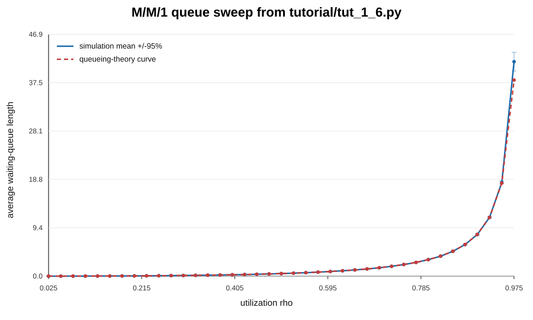

.. _tut_1:

1. A single-server queue
========================

In this chapter we develop one small model from scratch, then grow it: we
watch it run, measure it properly, package it as a reusable component, sweep a
parameter across all CPU cores, and finally drive it with recorded data
instead of a textbook distribution.

Our system is the **M/M/1 queue**. In queueing notation that means arrivals
are memoryless (exponentially distributed gaps), service times are
exponential too, there is **1** server, and the waiting line has no limit. It
is about the best-understood system in queueing theory, which is exactly what
we want for a first model: if our simulation disagrees with the formula, the
bug is ours.

The formula we will check is the expected number of customers *waiting* (not
counting the one being served):

.. math::

   L_q = \frac{\rho^2}{1 - \rho}

where :math:`\rho` is the utilization, the arrival rate divided by the service
rate. With arrivals at rate 0.75 and service at rate 1.0, :math:`\rho = 0.75`
and :math:`L_q = 2.25`.

.. contents:: In this chapter
   :local:
   :depth: 1

Arrival, service and the queue
------------------------------

Think about what the system *is* before thinking about code. There is:

* an **arrival process** that, again and again, waits a random time and then
  adds a customer to the line;
* a **service process** that, again and again, takes a customer from the line
  (waiting if there is none) and spends a random time serving them;
* the **line** itself. We don't care who the customers are, only how many are
  waiting, so a simple counter is enough.

In Cimba Python, each of those becomes one line or one method of a
:class:`cimba.Model` subclass:

.. literalinclude:: ../../tutorial/tut_1_1.py
   :pyobject: MM1
   :caption: tutorial/tut_1_1.py
   :linenos:

Before reading it line by line, here is the model as
:func:`cimba.diagrams.process_graph` draws it straight from this code:
inputs feed processes, the arrival process puts into the queue, and the
service process gets from it.

.. cimba-diagram:: tutorial.tut_1_1:MM1
   :direction: LR

Let's go through it.

**Inputs** (lines 2–3). ``interarrival`` and ``service_time`` are the two
sources of randomness in the system. Declaring them as
``cb.Input[float]`` says "this model consumes a sequence of floats". The value
after ``=`` is the *default source*: exponential distributions with means
1/0.75 and 1.0. We'll see later why keeping *what* the model consumes separate
from *how* it is produced is so useful.

**An entity** (line 4). ``queue: cb.Container`` declares a native simulation
entity: a counted level that processes can ``put`` into and ``get`` from. A
``get`` on an empty container *blocks* until something arrives. The container
also keeps time-weighted statistics about its level.

**An output** (line 5). ``avg_queue_length: cb.Output[float]`` is a number the
trial reports when it finishes. Each trial gets its own copy.

**Processes** (lines 7–17). Methods decorated with ``@cb.process`` run as
simulated processes. They start when the trial starts and run concurrently in
simulated time. Read ``arrival`` aloud: *forever: wait for the next gap, then
put one customer in the queue.* ``service`` reads just as naturally.

The interesting lines are the blocking calls. ``cb.hold(t)`` suspends the
process for ``t`` units of simulated time. ``self.queue.get(1)`` suspends it
until the queue has a customer to hand over. While one process is suspended,
the engine runs whichever event is next in time, maybe the other process
waking up. When a process resumes, it continues on the very next line, with
all its local variables intact. There is no ``yield``, no callback chain and
no state machine. Cimba processes are *stackful coroutines*, so a blocking call
can happen anywhere, even deep inside a helper function.

**A hook** (lines 19–21). ``@cb.on_end`` marks a method that runs once after
the simulation stops. Here it reads the container's time-weighted mean level
into our output.

.. admonition:: What is ``self`` inside a process?
   :class: note

   Process and hook methods are compiled to machine code with Numba. Inside
   them, ``self`` is not the Python object you created. It is a typed *view*
   of this trial's private copy of the model's data. ``self.queue`` is the
   trial's native container, and ``self.interarrival`` is the trial's input
   handle. That is why every trial can run on its own core without sharing
   anything. The rules for compiled code are collected in
   :doc:`../concepts/compiled_code`.

Running an experiment
---------------------

A model class only describes the system. To simulate it we create an instance
and hand it to an :class:`~cimba.Experiment`:

.. literalinclude:: ../../tutorial/tut_1_1.py
   :pyobject: main
   :linenos:

``cb.Window(duration=10.0)`` tells the trial to simulate ten time units.
``seed=42`` makes the run reproducible: the same seed gives exactly the same
random numbers, on any machine and with any number of worker threads.

``run()`` compiles the model class (the first time only), runs the trial on
the native engine and returns a :class:`~cimba.Results`. We read the output
back **through the model object**: ``results[model].avg_queue_length``. That
is an array shaped ``(design points, replications)``, here ``(1, 1)``, so
``[0, 0]`` picks our only trial.

.. code-block:: console

   $ uv run python tutorial/tut_1_1.py
   Average queue length over the first 10 time units: 0.301895

That's nowhere near 2.25, and it shouldn't be. Ten time units is a handful of
customers, and the queue started empty. But it proves the pieces are
connected. Next, let's see what's going on inside.

How a trial runs, and how it stops
----------------------------------

Both processes loop forever, so what stops the simulation? The
**measurement window** does. Every trial follows the same timeline:

.. raw:: html
   :file: ../static/diagrams/timeline.svg.html

1. Entities are created and every ``@cb.on_start`` hook runs.
2. All ``@cb.process`` methods start at time 0.
3. At ``warmup``, entity statistics are reset and recording begins.
4. At ``warmup + duration``, recording stops.
5. At ``warmup + duration + cooldown``, the model's processes are stopped.
6. Once no events remain, every ``@cb.on_end`` hook runs, and outputs are
   read.

``cb.Window(warmup=100, duration=5_000)`` is the usual choice for a
steady-state question: throw away the start-up transient, then measure.

Some systems have a natural end instead: a day's orders, a batch of jobs. For
those, use ``cb.Window.until_idle()`` (also the default if you pass no
window). The trial runs until the event queue is empty, recording from time 0.
And when the *model* decides it's done, for example after the 1,000th
customer, a process can call ``cb.end_trial()``. The event loop stops
immediately, the ``on_end`` hooks still run, and the trial counts as a
success.

Watching it run: logging
------------------------

When a model is small, the fastest way to trust it is to watch it. Compiled
processes can write to the engine's logger with :func:`cimba.log`, which
takes a flag, a **literal** message string and an optional number:

.. literalinclude:: ../../tutorial/tut_1_3.py
   :pyobject: MM1.arrival

User messages are filtered by a bitmask, so you can leave ``cb.log`` calls in
your model and switch categories on only when you need them:

.. literalinclude:: ../../tutorial/tut_1_3.py
   :pyobject: main

.. code-block:: console

   $ uv run python tutorial/tut_1_3.py
   0     0.85030  arrival  python (0):  Puts one into the queue
   0     0.85030  arrival  python (0):  Holds for 0.497785
   0      1.0076  service  python (0):  Gets one from the queue
   0      1.0076  service  python (0):  Got one, services it for 0.283735
   0      1.2913  service  python (0):  Gets one from the queue
   0      1.3481  arrival  python (0):  Puts one into the queue
   ...

Each line shows the trial index, the simulated time, the process name and our
message. The trace reads like a story. At t = 1.2913 the server asks for a
customer, finds none and blocks. At 1.3481 the arrival puts one in, and in the
same instant the server wakes up and starts serving. That is the blocking
semantics working exactly as described.

.. tip::

   Log output from parallel trials interleaves. Use ``run(workers=1)`` and a
   short window while debugging, and turn logging off
   (``cb.set_engine_log_level(0)``) before large runs.

Collecting statistics
---------------------

Now let's measure properly. We need two things: a long run, so the average
settles, and a warmup, so the empty start doesn't bias it.

.. literalinclude:: ../../tutorial/tut_1_4.py
   :pyobject: main

.. code-block:: console

   $ uv run python tutorial/tut_1_4.py
   Average queue length: 2.119869

Closer to 2.25. The remaining gap is noise from a single run, which we'll deal
with shortly by running many replications.

Datasets and captured histories
~~~~~~~~~~~~~~~~~~~~~~~~~~~~~~~

``mean_level()`` is a *time-weighted* statistic: it answers "on average over
time, how long was the queue?" Sometimes you want plain samples instead, such
as one value per customer. That's what a :class:`~cimba.Dataset` is for:

.. literalinclude:: ../../tutorial/tut_1_2.py
   :pyobject: MM1
   :emphasize-lines: 5, 14, 26

``record(value)`` adds a sample; ``sample_mean()``, ``sample_count()`` and
``sample_max()`` summarize them inside the trial. Datasets are cleared when the
measurement window opens, so warm-up samples never pollute your statistics.
Without a warmup the window opens as the processes start, so samples they
record at time 0 count, but samples recorded in ``@cb.on_start`` hooks do not.

Summaries are often enough. When you want the full picture, a histogram or a
plot of the queue over time, ask Cimba to **capture** the entity:

.. literalinclude:: ../../tutorial/tut_1_2.py
   :pyobject: main
   :emphasize-lines: 3-4, 8

An entity declared without a value, like ``queue: cb.Container``, is created
for you when the experiment is set up. To *configure* one, create it yourself
and assign it (line 3). Then ``capture()`` is set on that entity **object**
before the run. Afterwards
``results[model].queue`` is a :class:`~cimba.Signal`, and
``.trial(point, replication)`` returns read-only ``(times, values)`` arrays.
A captured container gives you every change of its level. A captured dataset
gives you its samples (and an empty ``times`` array). Plotting the queue is
then ordinary matplotlib:

.. code-block:: python

   import matplotlib.pyplot as plt

   times, level = results[model].queue.trial(0, 0)
   plt.step(times, level, where="post")
   plt.xlabel("simulated time")
   plt.ylabel("customers waiting")

Captures keep every sample of every trial in memory, so enable them on the
entities you need to look at, not by default.

Packaging the queue as a component
----------------------------------

Real models have parts. Before our model grows, let's separate the *station*,
the queue with its arrivals and server, from the *study* that measures it.
Models can contain other models:

.. literalinclude:: ../../tutorial/tut_1_5.py
   :pyobject: MM1Station

.. literalinclude:: ../../tutorial/tut_1_5.py
   :pyobject: MM1

``station: MM1Station`` declares a **child model**. We create it in
``__init__`` like any Python attribute. Inside compiled code,
``self.station.queue`` reaches the child's container directly. A child can
have its own processes, hooks, inputs and children, to any depth.

Because the station is an object, we configure it as one. Here we set the
utilization by replacing the station's arrival source:

.. literalinclude:: ../../tutorial/tut_1_5.py
   :pyobject: run_mm1_trial
   :emphasize-lines: 4

.. note::

   ``__init__`` runs only in Python, when you *build* the model. It wires up
   the object graph and sets values. It is never compiled and never runs
   inside a trial. Constructing a model is cheap and has no side effects:
   nothing is compiled until ``run()``.

Sweeping utilization across all cores
-------------------------------------

One trial answers one question once. To validate the model we want the
average queue length at many utilizations, each with several independent
**replications**, so we can put a confidence interval on it. That is a
**sweep**:

.. literalinclude:: ../../tutorial/tut_1_6.py
   :pyobject: sweep_rho
   :emphasize-lines: 6-8

``cb.sweep(*values)`` creates a **design axis**. You can assign a sweep to any
``Param`` field, or, as here, use it inside a source: ``axis.map(f)`` derives
a second sweep that moves in lockstep with the first. The experiment expands
every sweep into **design points** (39 here) and runs ``replications`` trials
at each: 390 independent trials, spread over all CPU cores.

Results keep that shape. ``results[model].avg_queue_length.values`` is a
``(39, 10)`` array, one row per design point, and ``results.levels(axis)``
tells you the swept value at each row.

.. code-block:: console

   $ uv run python tutorial/tut_1_7.py -n 10 -d 100000 -w 1000 -t
   cimba 3.0.0
        rho  simulated     +/-95%     theory
      0.025     0.0006     0.0001     0.0006
      ...
      0.500     0.4980     0.0084     0.5000
      ...
      0.750     2.2335     0.0729     2.2500
      ...
      0.950    17.8149     1.9570    18.0500
      0.975    38.9006     6.3865    38.0250

   390 trials in 2.38 s

         theoretical curve.
   :width: 100%

   Simulated mean queue length (points with 95% intervals) against the
   theoretical curve :math:`\rho^2/(1-\rho)`.

Every confidence interval covers the theoretical value. Our model is right,
or at least close enough that we have probably connected the pieces
correctly. Notice how the intervals widen near :math:`\rho = 1`: a nearly
saturated queue has long, slow excursions, so each run says less about the
mean.

You don't have to compute intervals by hand.
:func:`cimba.analysis.summary` does it per design point:

.. code-block:: python

   summary = cb.analysis.summary(results[model].avg_queue_length)
   summary.mean, summary.lower, summary.upper   # one entry per design point

.. admonition:: Why every design point sees the same random numbers
   :class: important

   By default, replication *r* uses the same seed at every design point. This
   is called **common random numbers** (CRN). The 17th customer in
   replication 3 arrives at the same *quantile* of the gap distribution
   whether :math:`\rho` is 0.5 or 0.9. Differences between design points then
   reflect your change, not luck, and :func:`cimba.analysis.compare` can use
   *paired* statistics with much tighter intervals. Pass
   ``seeding="independent"`` to ``Experiment`` if you need independent
   points instead.

From distributions to data
--------------------------

So far our arrivals come from a textbook exponential distribution. In a real
study you would have *data*: timestamps from a door counter, log lines from a
web server. This is where Cimba Python differs from most simulation
libraries. The model doesn't change at all. Only the **source** bound to the
input changes.

.. code-block:: python

   import numpy as np
   import cimba as cb
   from cimba import inputs
   from tutorial.tut_1_4 import MM1

   gaps = np.loadtxt("observed_gaps.csv")   # measured inter-arrival times

   model = MM1()
   model.interarrival = cb.sweep(
       inputs.dist.exponential(mean=1 / 0.75),   # the textbook assumption
       inputs.trace(gaps, on_exhausted="wrap"),  # replay exactly what happened
       inputs.bootstrap.iid(gaps),               # resample the observations
   )
   results = cb.Experiment(model, replications=30,
                           window=cb.Window(warmup=100.0, duration=2_000.0),
                           seed=5).run()

   print(cb.analysis.summary(results[model].avg_queue_length).mean)
   print(cb.analysis.compare(results[model].avg_queue_length, a=0, b=2))

Here we swept the *source itself*. Three design points run the same compiled
class: one draws from a distribution inside the trial, one replays the
recording, one resamples it. The three inputs are called differently but read
identically: every process still just calls ``self.interarrival.next()``.

Each source kind answers a different question:

.. list-table::
   :header-rows: 1
   :widths: 30 70

   * - Source
     - Use it when…
   * - ``inputs.dist.*``
     - you have a theoretical or fitted distribution (``inputs.fit(data)``
       ranks candidates for you).
   * - ``inputs.trace(data)``
     - you want to replay history exactly, for example to validate the model
       against what really happened.
   * - ``inputs.bootstrap.*``
     - you want *new* plausible histories that keep the data's real shape,
       including its autocorrelation with block methods.
   * - ``inputs.fitted.*``
     - the data has trend or seasonality you want to keep and extrapolate.

After the run, each input reports what it did:

.. code-block:: python

   record = results[model].interarrival
   record.source      # one provenance description per design point
   record.consumed    # values drawn in every trial, shaped (points, replications)
   record.extended    # how often a resample had to be regenerated longer
   record.rows(1, 0)  # the exact values trial (point 1, replication 0) saw

A recorded trace is finite. What happens when a trial needs more gaps than
you recorded? You decide with ``on_exhausted``: ``"fail"`` (the default, which
fails the trial with a message naming the input) or ``"wrap"`` (start again
from the beginning). Resampled and fitted sources never run out: when a trial
needs more values, Cimba regenerates a longer row that starts with *exactly*
the same values and reruns that trial, so the result is as if the row had been
long enough from the start.

Chapter 6 builds a full data-driven study on this idea. The concepts behind it
are in :doc:`../concepts/inputs`.

What you learned
----------------

* A model is a class; annotated fields declare **inputs**, **entities**,
  **outputs**, and later **params**, **state**, children and references.
* ``@cb.process`` methods are concurrent simulated processes. Blocking calls
  such as ``cb.hold`` and ``get`` suspend them, anywhere in the code.
* ``@cb.on_start`` and ``@cb.on_end`` hooks run before and after the event
  loop.
* A ``Window`` sets warmup, measurement and cooldown, or runs until idle.
* Datasets collect samples; ``capture()`` keeps full histories for plotting.
* ``cb.sweep`` creates design axes; an experiment runs points × replications
  in parallel with common random numbers.
* Inputs separate *what* a model consumes from *how* it is produced, so the
  same compiled model runs on distributions, traces and resamples.

Next, in :doc:`cheese`, processes stop being polite and start fighting over a
shared resource.
